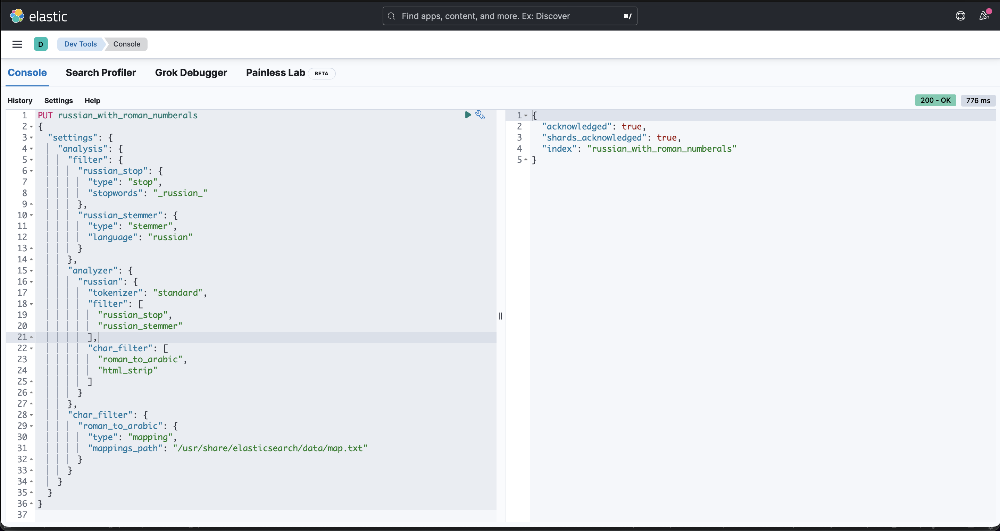
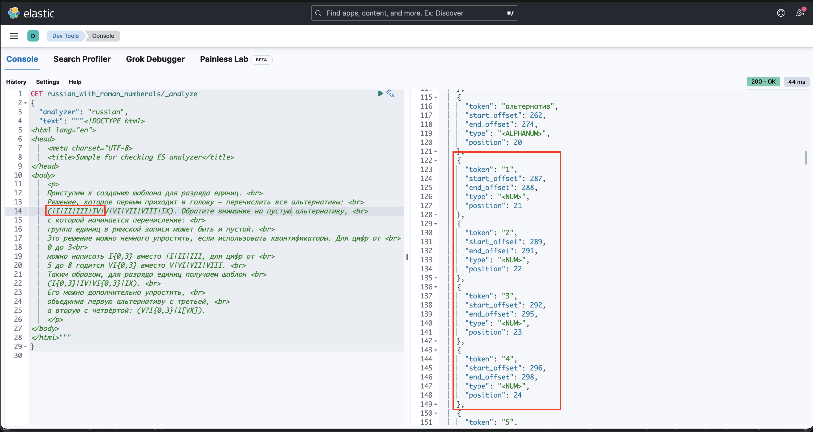

# Text analysis task

## Deployment

```shell
docker-compose -f ../elastic_kibana_compose.yaml up -d
```

## Step-by-step guide
1. Build roman-to-arabic mapping file.

```shell
python build_roman_mapping.py \
       --output-path ../elsaticserach-data/map.txt
```

2. Go to [Kibana console](http://localhost:5601/app/dev_tools#/console).
3. Paste content of `analyzer.txt` and send the request.

4. Paste content of `example.txt` and send the request.

5. Example response is provided in `response.txt`